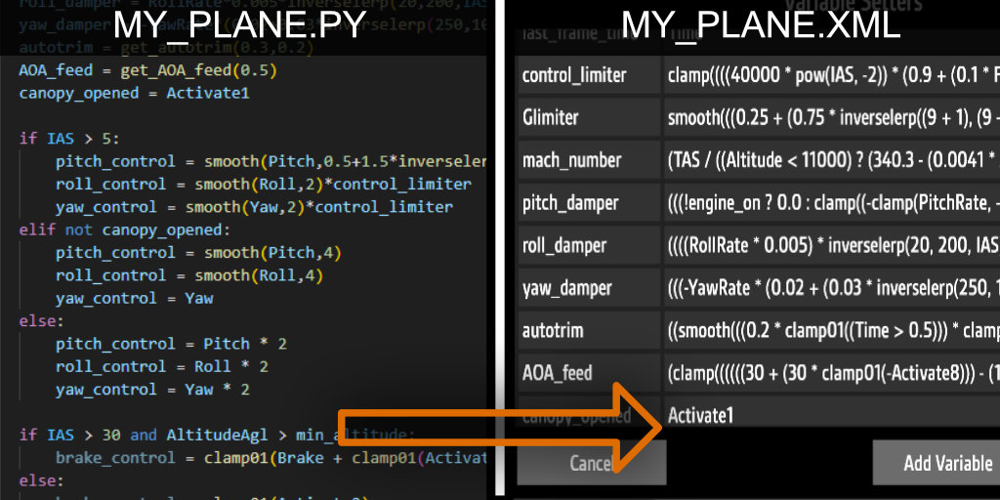

# PYtoFT
Python to Funky Trees Mini Compiler
by Whills

## Overview

PYtoFT converts variables in a Python script into condensed, single-line functions compatible with the SimplePlanes / SimplePlanes2 Funky Trees system.

The tool can:
- Automatically update the .xml file of a SimplePlanes craft, or
- Update the .xml file next to your .py script, or
- Output the generated XML code directly to the console for copy-paste use.



> [!CAUTION]
> - It is not recommended to use this tool unless you are familiar with the basics of Python and how Funky Trees work in SimplePlanes.
> - Incorrectly written Python code may result in conversion errors or unexpected in-game behavior. Use this tool at your own risk.

## How It Works

- Parses variable definitions from a Python script using [ast](https://docs.python.org/3/library/ast.html) module.
- Converts them into SimplePlanes-compatible Funky Trees expressions.
- Outputs the result as XML code, either by injecting it into an existing craft file or printing it for manual use.

## How to Use (Windows)

- Go to the [Releases section](https://github.com/whillx/PYtoFT-Python-to-FunkyTrees-Mini-Compiler/releases) and download the .zip file.
- Unzip the downloaded archive.
- Place the Python .py file you want to convert in the same directory as _PY_to_FT.exe.
- Run _PY_to_FT.exe to start the conversion.
- If you choose to export directly to your SimplePlanes .xml save:
    - Select the folder containing the .xml file.
    - Ensure the .xml file has the SAME NAME as your .py file.
- If you choose to export to the current directory:
    - Make sure the corresponding .xml file is already present in the same directory as the .py file.
- You may need to reload your aircraft in game to see the to your Funky Trees code changes.

## Run Locally (Python)

- Install Python 3 and download or clone [this project](https://github.com/whillx/PYtoFT-Python-to-FunkyTrees-Mini-Compiler)

- Run:
    ```bash
    python _PY_to_FT.py
    ```

## Example Script

Full working demo script: [demo script](0_demo_plane.py)

Demo airplane XML: [Pyphoon demo plane](0_demo_plane.xml)

- The Python script must have the same name as the target SimplePlanes .xml craft file.
- Do not start your file name with an underscore.

```python
from lib.FT_functions import * # import built-in Funky Trees functions and variables.
main_loop_name = "_process" # the name of the main function
exclude = ["exported_var"]  # list of variable names to be excluded from the conversion,
                            # you may need to add some aircraft-part-exported variables here.

# ========== program start ==========
# optional: declare your global variables
my_global_var = 1.0
exported_var = False

# main loop function: the control logic in this function will be executed once every frame in game.
# all variables declared inside this function + all global variables will be converted to in-game variables.
# you can also do not write this function, then only global variables will be converted.
def _process() -> None:
    global my_global_var
    global exported_var
    simple_var = 2000.0
    if my_global_var:
        if IAS > exported_var:
            another_simple_var = foo(simple_var)
        else:
            another_simple_var = 0
    else:
        another_simple_var = -1

# below are helper functions, make sure all functions have return values in all cases.
# it's not recommended to call other helper functions inside helper functions.
# default argument values are *NOT* supported and do *NOT* use recursion!
def foo(some_value) -> float:
    input_val = some_value
    if Altitude > 200:
        input_val += 2
    else:
        input_val -=2
    result = input_val + bar()
    return result

def bar() -> float:
    if IAS > 10:
        return 5
    else:
        return 0

```
The script above can be converted to the following XML code:
```xml
<Setter variable="my_global_var" function="1.0" priority="0" />
<Setter variable="simple_var" function="2000.0" priority="0" />
<Setter variable="another_simple_var" function="(my_global_var ? ((IAS &gt; exported_var) ? (((Altitude &gt; 200) ? (simple_var + 2) : (simple_var - 2)) + ((IAS &gt; 10) ? 5 : 0)) : 0) : -1)" priority="0" />
```

> [!NOTE]
> This tool can only convert **simple functions**. The following Python features are **not currently supported**:
> - Classes
> - Recursion
> - Default arguments
>
> If you want to reconfigure the directory of your target output folder, you can delete _PY_to_FT_config.json and run the application again.

> [!CAUTION]
> Always backup your `.xml` craft file before running the conversion.
> The conversion will overwrite ALL Funky Trees codes you have already written in game in Variable Setters.

## Next Steps

I hope you find this tool useful. In the future, it would be interesting to support the conversion of other popular languages (such as C#, Java, or JavaScript) into Funky Trees; however, this is currently beyond the scope of my skills.

I may also pursue future updates to expand support for additional Python features.

If you find this work useful, any amount of support would be appreciated: [Patreon](https://www.patreon.com/c/WhillsBuildsPlanes)

This project is licensed under the GNU General Public License v3.0 (GPL-3.0-or-later).